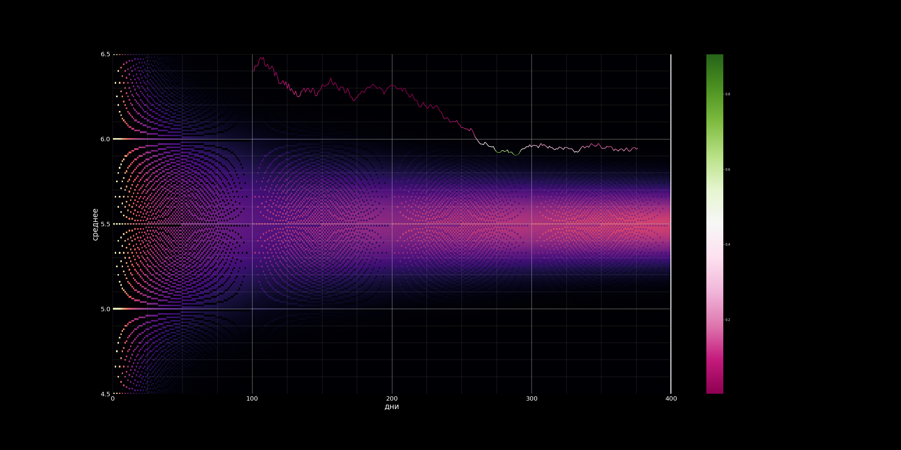

С августа 2020 года Дэвид Линч ежедневно [достаёт из банки](https://youtube.com/playlist?list=PLTPQcjlcvvXFtR0R91Gh5j9Xi8cq0oN3Y) шар с числом от 1 до 10. Если Линч достаёт шары с равной вероятностью, среднее значение должно сходиться к 5.5 довольно быстро, но реальное среднее всегда оказывается сильно выше ожидаемого.

Это — симуляция "TODAY'S NUMBER IS..." Линча. Эксперимент прогоняется множество раз, чтобы построить распределение средних в зависимости от дня. На визуализации по иксам откладывается день, по игрекам среднее значение, цветом кодируется вероятность такого значения. Также есть график реальных значений, где цветом закодирована вероятность иметь такое значение или выше — значения на колорбаре указаны в процентах. Если у вас не зудит мозг от этого, то я не знаю, можно ли вам как-то помочь.

