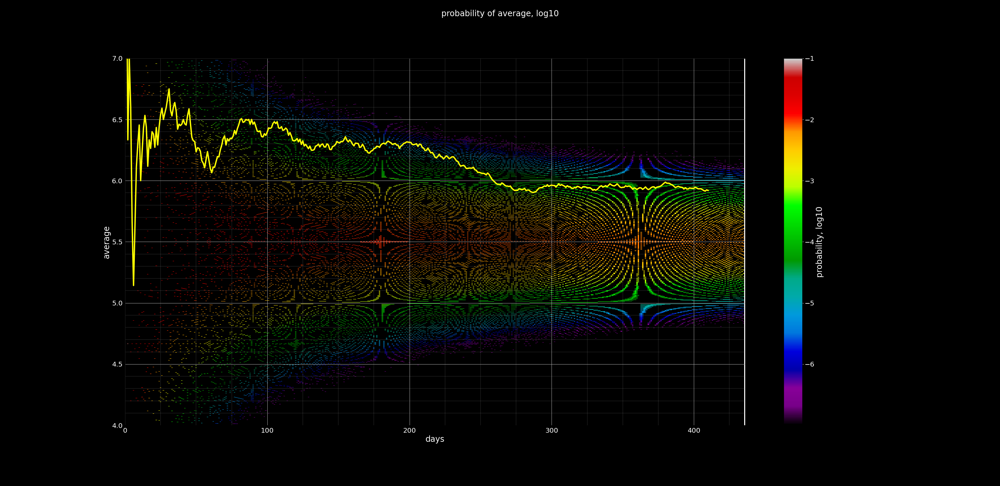
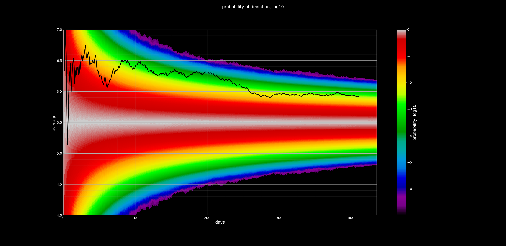

Савгуста 2020 года Дэвид Линч ежедневно [достаёт из банки](https://youtube.com/playlist?list=PLTPQcjlcvvXFtR0R91Gh5j9Xi8cq0oN3Y) шар с числом от 1 до 10. Если Линч достаёт шары с равной вероятностью, среднее значение должно сходиться к 5.5 довольно быстро, но реальное среднее всегда оказывается сильно выше ожидаемого.

Это — симуляция "TODAY'S NUMBER IS..." Линча. Эксперимент прогоняется множество раз, чтобы построить ожидаемое 
распределение средних в зависимости от дня. На визуализациях по иксам откладывается день, по игрекам среднее значение. Линией изображена реальная последовательность. 

1. Здесь цветом кодируется логарифм вероятности получить среднее в интервале <nobr>(p - 7.5⋅10-4, p + 7.5⋅10-4)</nobr>.

2. Здесь — логарифм вероятности получить отклонение от 5.5 не меньше заданного

Видно, что вероятность реального расклада к настоящему времени (день 383) составляет существенно меньше одного процента. Пользователь [Seth M-T](https://www.youtube.com/channel/UCVm0NV9XOmjo_GqX8_GfW7Q) написал [статью](https://drive.google.com/file/d/1phGBTZJZRy2cFML8pyKix1taXj0col0V/view), где рассматривает это системное отклонение и выдвигает гипотезы о его возможных причинах. Феномен требует объяснения. Возможно, рационального объяснения нет, и мы имеем дело с чудом.